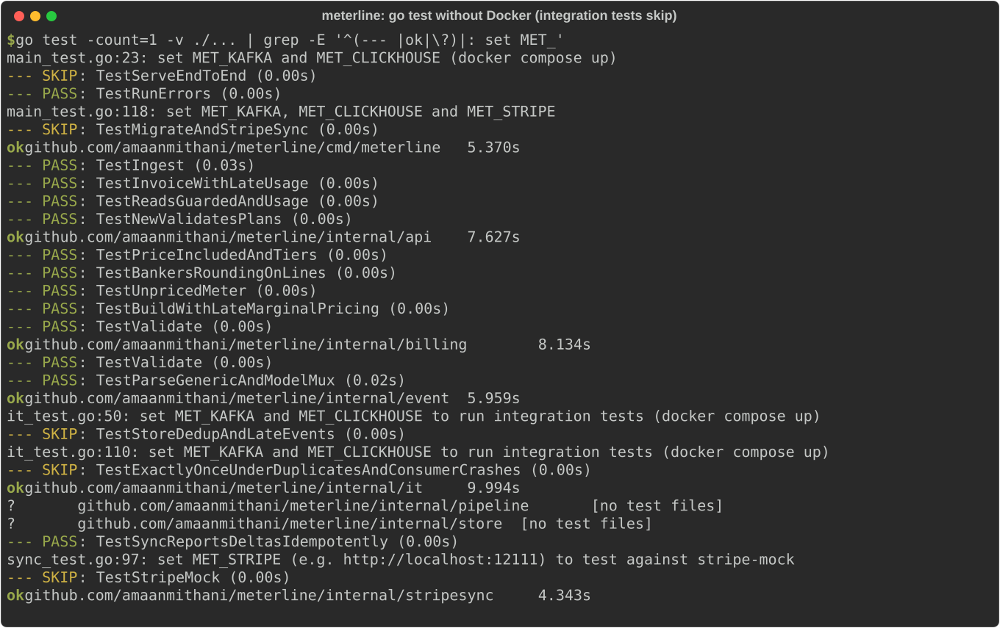

# meterline

> **Credits.** Built by Amaan Mithani with Claude (Anthropic) as the AI coding assistant.

Usage metering and billing: exactly-once event counting on Redpanda and ClickHouse, plans,
invoice previews, Stripe sync. Work in progress. See [docs/SPEC.md](docs/SPEC.md).

## See it running

*Local run, 2026-09-26, without Docker. This is only the part that runs without infrastructure: unit tests for ingest, pricing and invoices, event parsing and the Stripe delta sync. The end-to-end, exactly-once and stripe-mock tests need `docker compose up` and were skipped here, as the output shows. The web dashboard needs the live API and ClickHouse, so there is no dashboard screenshot yet.*
